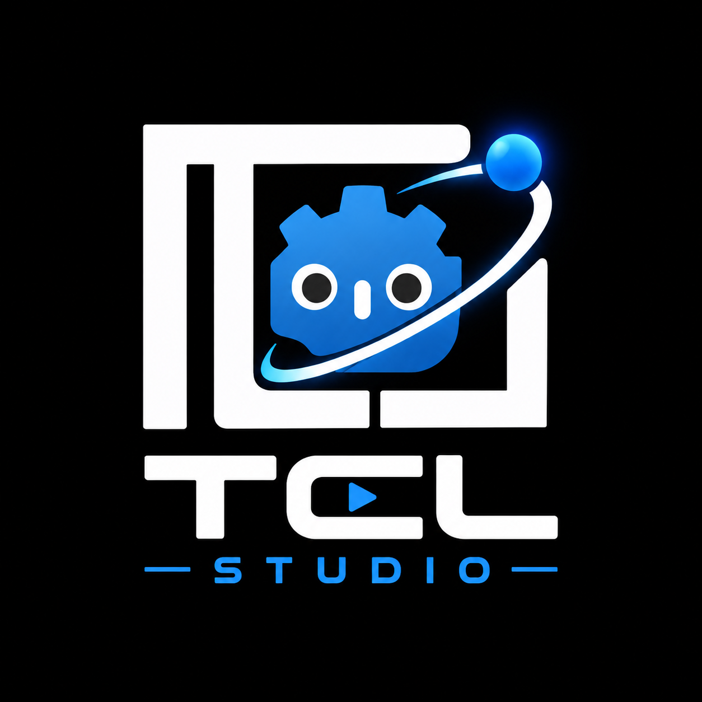

# tcl-studio

`tcl-studio` is a Godot-based visual studio for creating procedural scientific,
mathematical, and physics-driven videos. The project is designed around a simple
workflow: build reusable visual entities, expose their meaningful controls in the
Inspector, and animate them with `AnimationPlayer` to create clean, explainable
shots without writing custom code for every scene.

The idea is not to build a single game, but to create a reusable toolkit for
explaining concepts visually. If an object can be parameterized, styled, and
animated in the editor, it becomes a building block for scientific storytelling
and procedural motion design.

## Core idea

This project treats Godot as a motion-graphics and scientific visualization
studio rather than a traditional game project. The workflow is:

1. Create or reuse a procedural object.
2. Expose important properties in the Inspector.
3. Tune the visual state directly in the editor.
4. Animate the scene with keyframes and timelines.
5. Capture the result as a video.

This keeps most production work visual and editable. Code is used when a new
feature or behavior is truly needed, but the goal is to keep standard video
creation in the editor as much as possible.

## What this project is for

`tcl-studio` is focused on producing shots and scenes for:

- mathematical animations
- physics explanations
- chemistry and molecular visualizations
- procedural environments and structures
- geometric diagrams and shape-based motion graphics
- camera-driven storytelling with editor-tuned animation

The library is intentionally organized around reusable systems that can be
combined to explain ideas without needing to hand-code large portions of each
new animation.

## Current library structure

The active project structure is centered around the `library/` directory and its
core feature groups:

- `animation_handlers/` - reusable animation logic for fades, movement,
  transforms, creation effects, property tweens, and timed action sequencing.
- `base/` - base Godot nodes, helpers, and reusable visual primitives for 2D,
  3D, labels, backgrounds, meshes, and presentation elements.
- `Chemical Elements/` - atom, bond, and molecule-related systems for chemistry
  and scientific visualizations.
- `environmental entities/` - procedural structures and world-building
  generators such as houses and stylized environment components.
- `GodoTeX/` - mathematical and TeX-style rendering support.
- `Indications/` - visual emphasis and annotation effects.
- `mesh-premitive-wrapper/` - wrappers and helpers for mesh-based generation.
- `misc/` - small supporting utilities and experiments.
- `Shaders/` - shader-based materials and visual effects.
- `shapes-2d/` and the `shapes-derived/`, `shapes-derived-quad/`, and
  `shapes-derived-RSBased/` folders - reusable geometry and shape systems for
  diagrams and visual storytelling. `shapes-derived-quad/` builds shapes from
  quads, while `shapes-derived-RSBased/` is built around render-oriented
  primitives.

Removed experimental folders such as `BlobCharacter/` and the old `brackeys_vfx_bundle/`
content are not part of the current project scope.

## The Chopstick Lab project content

`content/the-chopstick-lab/` holds material specific to The Chopstick Lab video
page, separate from the reusable visual toolkit. It includes folders for images,
QR codes, demo videos, and reference material such as scripts, research notes,
and briefs. See `content/the-chopstick-lab/README.md` for the folder layout.

## Documentation
See [DOCUMENTATION.md](DOCUMENTATION.md) for an index of the reusable systems
and links to setup, animation, geometry, science, and rendering guides. The
individual guides live in `docs/`.

## Editor add-ons

The `addons/` directory contains three editor plugins. Enable them from
**Project > Project Settings > Plugins**; all three are already enabled in
`project.godot`.

### Components Browser (`addons/components_browser/`)

Adds a `Components` tab to the editor's bottom panel. It presents the curated
(`class_name`) nodes in `library/` with search and category filters, so they can
be added directly to the selected scene node without browsing Godot's full node
list. Drag an entry onto the 2D or 3D editor to add it to the Scene Tree, or
double-click it (or select it and choose **Add to Scene**).

### Render Queue (`addons/render_queue/`)

Adds a `Render Queue` tab that queues scenes and renders them to video through
Godot's Movie Maker mode, one job per separate Godot process. See
[its README](addons/render_queue/README.md) for usage and output formats.

### tcl-gui (`addons/tcl-gui/`)

Provides bindable 2D GUI controls (slider, toggle, button, stepper, level meter,
circular slider, and range slider) plus a `BindTarget` resource that maps a
control's value to a node property or method. An inspector plugin turns the
binding target into a dropdown of the real properties and methods on the chosen
node. See [its README](addons/tcl-gui/README.md).

## Project setup

- Engine: Godot 4.7
- .NET target: `net8.0`
- Languages: GDScript and C#
- Rendering: Forward Plus (Direct3D 12 driver on Windows)
- Physics: Jolt Physics
- Platform focus: Windows development workflow

The project config is set up as a Godot .NET project and includes support for
C# along with a few scientific/visual packages used for math and rendering.

## Using the `library/` directory on its own

If someone takes only the `library/` directory and uses it in a separate Godot
project, it is not a standalone, self-contained plugin by default. The library
assumes the Godot project is configured with the proper .NET environment and the
necessary C# references.

In that case, the user should install the required .NET components for the
project they are using, especially:

- .NET SDK compatible with the target project setup
- the Godot .NET support layer for C# scripts
- any NuGet packages referenced by the project, such as `CSharpMath`,
  `CSharpMath.SkiaSharp`, and `SkiaSharp`

In other words, when the library is used independently, the user must install
and configure the needed .NET modules and package dependencies separately, even
though the visual code itself is organized as a reusable Godot library.

## Reusable animation system

A central tool in the project is `ProcAnim`, which wraps common animation tasks
into a clean API for scene composition. It supports operations such as:

- moving and rotating nodes
- fader effects and transitions
- object creation/pop-in effects
- camera transforms
- visual indication rings and emphasis effects
- property tweening with timing and easing controls
- parallel and sequential animation patterns

This helps keep scenes expressive while still allowing the project to remain
editor-driven instead of script-heavy.

## Design philosophy

`tcl-studio` follows a few clear principles:

- editor-first authoring
- procedural generation over manual duplication
- reusable visual tools over one-off script logic
- deterministic parameters when needed
- visual clarity for scientific communication

The point is not simply to generate pretty objects, but to create scenes that
can be tuned, explained, and captured in a controlled way for video production.

## Current status

This project is an active visual toolkit and experimentation space. It is not a
finished product in the usual sense; it is a reusable library for building
scientific and procedural visual stories inside Godot. The cleanest workflow is
still to keep scenes strongly parameterized, visually adjustable, and animation-
ready so they remain easy to produce and refine over time.

## License

This project is available under the [MIT License](LICENSE).
