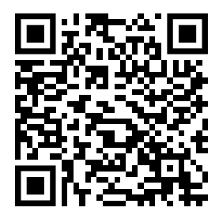
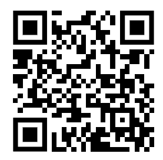

# Projects made with tcl-studio

`tcl-studio` is used to develop visual material for **The Chopstick Lab**:
scientific explanations, mathematical animations, procedural visualizations,
and related motion-design experiments.

## The Chopstick Lab

### Facebook

[Visit the Facebook page](https://www.facebook.com/profile.php?id=61583552736653)

### YouTube

[Visit the YouTube channel](https://www.youtube.com/@tc-lab)

These channels are the public home for videos and demonstrations created with,
or supported by, this library. The project-specific source material, QR codes,
and reference assets can be kept alongside this document in the surrounding
`the-chopstick-lab` content folder.
